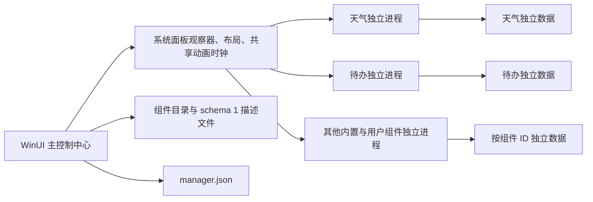

# 当前架构

已实现于 demo/NotificationCompanion。旧 src/manager、src/host 和原生 DLL SDK 继续保留，新控制中心不调用它们。

## 主控制中心

WindowsWidget.exe 默认打开控制中心，关闭窗口驻留托盘，再次运行或单击托盘打开已有窗口。主窗口直接展示启停、设置、重启、排序、主题、排列、创建、导入和扫描入口。主进程拥有唯一 ShellObserver 和 PanelMotion / MotionFrames；各组件不自行判断 Windows 面板开关。

## 独立运行

每个组件单独启动一个 WindowsWidget.exe --plugin 子进程。宿主可执行文件复用，但 WinUI Application、窗口、业务对象、配置和进程均独立。主进程的内部不可见 WinUI 窗口为运行时与诊断提供宿主，不作为额外卡片显示。

每个插件绑定单独 Job Object，在 CREATE_SUSPENDED 后绑定再恢复。启动握手含 PID 和 HWND，主程序核对窗口归属；20 秒未准备好显示超时。异常退出只回收对应实例，主窗口显示退出码，用户可以单独重启。不无限自动重启。停止前给正常进程最多 200ms 保存机会，随后终止自己的 Job；主进程意外结束时 KILL_ON_JOB_CLOSE 回收子进程。

目前每个定义一个实例，未提供同一组件多实例，也未加载第三方代码。进程隔离不等于安全沙箱。

## 外观和动画

每个子进程仅创建自己的卡片和必要的普通编辑窗口。原生 WinUI 控件、AcrylicBackdrop、圆角与主题统一；不使用截图代替交互，不跨进程传 WinRT 对象，不挂接 Explorer。

主进程按同一动画帧对各 HWND 平移和裁剪，所有卡片使用同一进出状态、曲线与时间。通知中心水平，快速设置纵向；8 DIP 间距，右下角优先。自由拖动通过子进程的标题指针事件处理，在约束区域内移动，并将结束状态通知主程序保存。

## 通信

每次启动生成唯一命名共享内存，协议为版本 1 的固定 POD 字段。父进程单向发布工作区、系统保留区、目标矩形、DPI、主题、排列和动画阶段；子进程单向发布就绪 HWND、拖动与修订号。短 seqlock 校验快照，主程序不等待插件提交帧。操作命令为有限的设置/刷新指令。没有任意 XAML、路径命令或脚本执行入口。

## 自定义组件

用户 widget.json 在导入和启动时分别验证，提供 text / note / checklist / links 四种声明式内容。允许修改内容、名称和高度，不允许修改系统保留区、窗口激活策略、材质或动画。自定义组件在独立 WinUI 子进程内渲染。

PluginCatalog.h 负责格式、长度、ID 和 HTTPS 链接校验；PluginProcess.h 负责进程、Job 和通道；ControlCenter.inc 负责管理交互；PluginRuntime.inc 负责业务表面与动作。组件目录独立，内置种类通过宿主编译的代码提供。

## 数据

%LOCALAPPDATA%\WindowsWidget\CompanionDemo 是数据根目录。manager.json 由主进程写入，保存以 ID 对应的启停、顺序、位置与主题。plugin-data/<id>/ 仅由自己的组件写入；plugins/<id>/widget.json 是用户组件定义。

首次升级将旧 widgets.json 复制到内置组件数据目录，保留原文件。之后业务数据独立写入，不串配置。临时文件加 MoveFileEx 原子替换。manager.json 损坏或版本不支持时保留原文件，以临时默认设置运行并显示原因。移除组件仅移除描述文件，保留业务数据。不承诺完整备份恢复或旧桌面管理器配置迁移。
